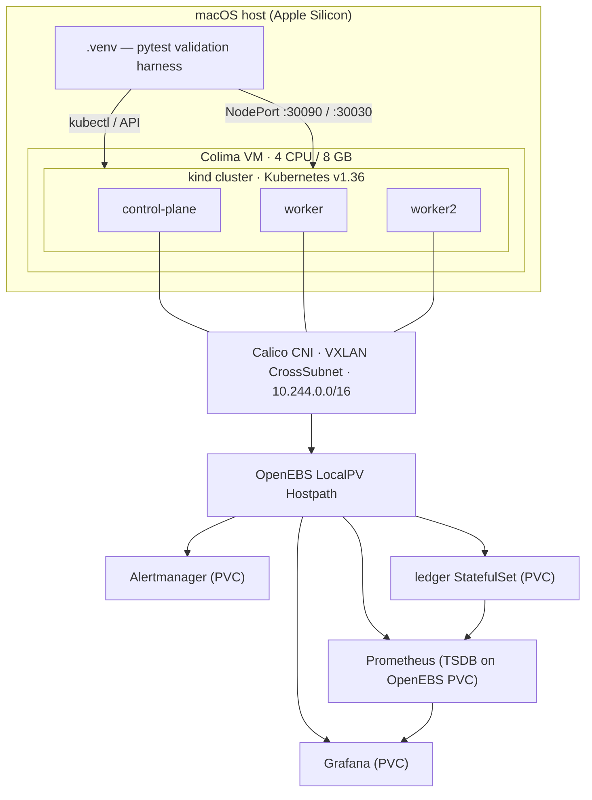

# k8s-cni-prometheus

A reproducible Kubernetes lab on a macOS laptop: a multi-node cluster built with
**no CNI**, then Calico installed by hand, OpenEBS for persistent storage,
Prometheus and Grafana for observability, and a Python test suite that proves
each layer actually works rather than merely reporting that it installed.

Everything is driven from a Python virtual environment and a `Makefile`. One
command builds the whole thing from a machine with nothing but Homebrew.

```bash
make all
```

## What it builds



The monitoring stack stores its own data on OpenEBS, so the storage layer is
exercised by a genuine stateful workload rather than only by a toy one.

## Quickstart

```bash
brew install colima docker kubectl kind helm python@3.12
colima start --cpu 4 --memory 8 --disk 60 --runtime docker

make all          # preflight → venv → cluster → cni → openebs → monitoring → workload → validate
make urls         # print endpoints and check they answer
```

Then open Grafana at <http://localhost:30030> (`admin` / `admin`).

## Dashboards

32 dashboards are installed: 29 stock kube-prometheus-stack ones plus three
built here, one per observability layer.

| Dashboard | Direct link | Shows |
|---|---|---|
| Infrastructure — Colima VM and kind nodes | [`/d/vm-infra`](http://localhost:30030/d/vm-infra) | VM CPU, memory, disk, I/O; per-node pods and network; top pods |
| OpenEBS — LocalPV Hostpath Storage | [`/d/openebs-storage`](http://localhost:30030/d/openebs-storage) | Real per-volume usage, consumed vs requested, node disk pressure |
| Application — ledger | [`/d/app-ledger`](http://localhost:30030/d/app-ledger) | Write rate, latency percentiles, errors, file growth |

Grafana's landing page is a welcome screen, not a dashboard list — use
**Dashboards** in the left nav. The stock dashboards are filed at the root; the
three above are in `Infrastructure`, `OpenEBS`, and `Applications` folders.

The three layers are deliberately distinct: node-exporter answers "is the VM out
of resources", cAdvisor and kube-state-metrics answer "what is this pod
consuming", and only the application's own `ledger_*` metrics answer "is it
actually working". A pod at 2% CPU looks healthy while failing every write.

Individual stages, in dependency order:

| Command | What it does |
|---|---|
| `make preflight` | Check host tooling, Docker, VM sizing |
| `make venv` | Build `.venv` and install the harness |
| `make cluster` | 3-node kind cluster, **deliberately with no CNI** |
| `make cni` | Install Calico; nodes go `NotReady` → `Ready` |
| `make openebs` | LocalPV Hostpath + default StorageClass |
| `make monitoring` | kube-prometheus-stack on OpenEBS volumes |
| `make workload` | Persistence demo StatefulSet |
| `make validate` | Full pytest suite (53 tests) |
| `make teardown` | Delete the cluster |

## Documentation

| Doc | Covers |
|---|---|
| [00 — Prerequisites](docs/00-prerequisites.md) | Host tooling, why Colima, sizing |
| [01 — Python environment](docs/01-python-environment.md) | The venv and the validation harness |
| [02 — Kubernetes install](docs/02-kubernetes-install.md) | kind topology, the no-CNI starting state, control-plane metrics |
| [03 — CNI and network validation](docs/03-cni-and-network-validation.md) | Calico install, pod CIDR, cross-node and NetworkPolicy proofs |
| [04 — OpenEBS storage](docs/04-openebs-storage.md) | Engine choice, StorageClass, PVC lifecycle |
| [05 — Monitoring stack](docs/05-monitoring-stack.md) | kube-prometheus-stack, scrape targets, storage-backed |
| [06 — Test workload](docs/06-test-workload.md) | The persistence proof, and instrumenting the app |
| [07 — Metrics and dashboards](docs/07-metrics-and-dashboards.md) | Why the obvious PVC metrics are wrong, and what to use |
| [08 — Troubleshooting](docs/08-troubleshooting.md) | Every failure hit while building this, with fixes |

## Validation

`make validate` runs 53 tests against the live cluster. No mocks — a pass means
the cluster did the thing.

| Suite | Proves |
|---|---|
| `test_01_cluster` | 3 nodes Ready, Calico on every node, pod IPs inside the configured CIDR |
| `test_02_networking` | Cross-node pod-to-pod, DNS, Services, and that NetworkPolicy is **enforced**, not just accepted |
| `test_03_storage` | StorageClass config, `WaitForFirstConsumer` behaviour, PV node pinning |
| `test_04_workload` | Data survives pod deletion; pod reschedules to the node holding its data |
| `test_05_prometheus` | Every scrape target up, recording rules produce series, volume usage real and growing, application metrics published and advancing |
| `test_06_grafana` | Datasource healthy from Grafana's side, stock dashboards present, and **every panel query on all three custom dashboards returns data** |

## Versions

Pinned in [scripts/lib.sh](scripts/lib.sh); bump deliberately, since the docs and
troubleshooting notes were written against these.

| Component | Version |
|---|---|
| Kubernetes (kind node) | v1.36.1 |
| Calico | v3.32.1 |
| OpenEBS chart | 4.5.1 |
| kube-prometheus-stack chart | 87.20.0 |
| Grafana | 13.1.1 |
| Python | 3.12 |

## Four things worth knowing up front

**The cluster starts broken on purpose.** `disableDefaultCNI: true` means nodes
report `NotReady` with `cni plugin not initialized` until you install Calico.
That makes the CNI step observable instead of invisible. See
[docs/02](docs/02-kubernetes-install.md).

**Control-plane metrics need a cluster-creation-time fix.** kube-controller-manager,
kube-scheduler, kube-proxy and etcd bind their metrics to `127.0.0.1` by default,
so Prometheus cannot reach them. This cannot be fixed after the fact without
editing static pod manifests, so the kubeadm patches live in
[cluster/kind-config.yaml](cluster/kind-config.yaml).

**The standard PVC usage metrics are wrong for hostpath volumes.**
`kubelet_volume_stats_*` reports the *node filesystem's* figures for every
hostpath volume — a 1Gi, 2Gi and 8Gi PVC all reported 58.76 GiB capacity here.
This lab ships a small exporter that measures volume directories directly. The
full derivation is in [docs/07](docs/07-metrics-and-dashboards.md).

**kind nodes share one kernel, so node metrics must not be summed.** All three
node-exporters report the same Colima VM — identical `MemTotal`, CPU count and
`node_boot_time_seconds`. `sum(node_memory_MemTotal_bytes)` therefore returns
~23 GiB for a 7.74 GiB VM, which is what the stock upstream node dashboards do.
The `vm-infra` dashboard here uses `max()`/`avg()` instead. See
[docs/08](docs/08-troubleshooting.md).
